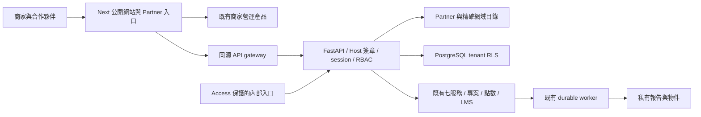

# KUANGUARD architecture — Partner increment, 2026-09-10

公共品牌依最新指示定位為數位科技公司，商家點餐與營運 SaaS 為旗下產品之一，產品頁為 `/products/ordering`。此 checkout 負責官網、產品入口、Partner 與既有資安業務；既有 Stallorder 系統繼續管理訂單、出單、商家角色、UsageEvent 與計費交易。沒有複製另一套點餐 backend，也沒有修改另一個產品的資料庫或部署。

Next `public` 部署面承載官網、客戶、學員與 Partner；`internal` 部署面提供內部工作台及 platform admin；`local` 只供 loopback 開發。Public 面拒絕 `/admin`、`/internal`、`/api/internal`、`/api/platform`。Partner 的 `/partner/workspace/internal/*` 是原有 router 的明示 allowlist aliases，仍經過個人委派、即時角色與專案範圍驗證。

客戶業務資料仍以原 `tenants.id` 與 `projects.id` 為主鍵。新 `organization_profiles` 分類組織，`partner_customers` 保存商務歸屬，`partner_customer_access` 保存個人服務授權；商務歸屬本身不能取得報告或執行權限。

中央 OIDC broker 與目標入口透過短期一次性 code 交換身份。BFF 用 server-only HMAC 保護實際 Host；Node fetch 的 transport Host 固定為 API origin，不能用它推斷 Partner。Secret 不進入前端 bundle。詳細見 [AUTH_ARCHITECTURE](AUTH_ARCHITECTURE.md)。

Partner commission、tenant OIDC/SAML provider 與 settlement 已建立 schema foundation，沒有啟用計算、SSO federation 或撥款。正式對外條件與各產品邊界見 [DEPLOYMENT](DEPLOYMENT.md)、[MANUAL_ACTIONS_REQUIRED](MANUAL_ACTIONS_REQUIRED.md)。
