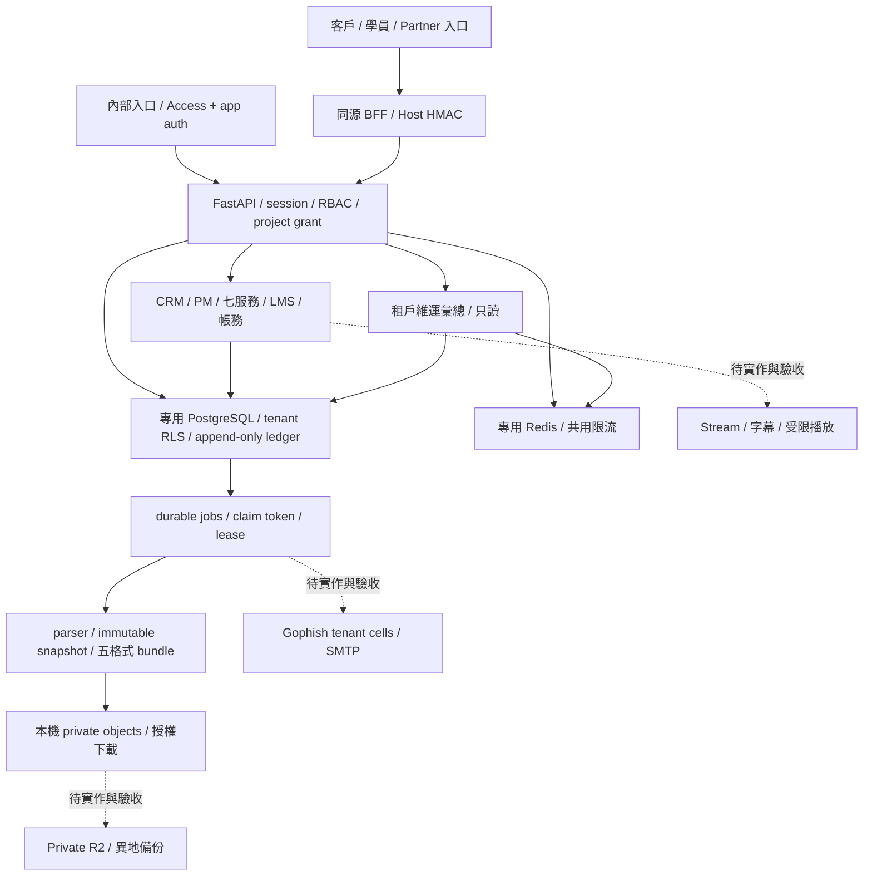

# 資安系統架構與工作區邊界

本工作區接續 KUANGUARD 資安系統；官網樣式由另一工作區負責。既有 `apps/web` 與 API 契約仍保留，沒有刪除頁面或複製另一套資料庫。Phase 狀態與剩餘工程集中於 [SECURITY_PHASE_STATUS](SECURITY_PHASE_STATUS.md)。

## 信任與資料邊界

1. Session 綁定真實 user／tenant，角色與 grant 每次重新核對；Partner 的商務客戶歸屬不自動取得報告權限。Broker 的一次性 code 與精確 Host 綁定防止跨域 replay。
2. PostgreSQL application role 非 owner／BYPASSRLS；受限表有 FORCE RLS、composite tenant FK 與 transaction-local scope。schema migration 使用獨立 role，原 revision 不回寫。
3. 工程師匯入 VA／WVA／SHC／PT／SOURCE，客戶只讀已發布 projection。Parser 把檔案當 inert data，不執行客戶源碼或任意網路掃描。人工覆核才產生 immutable snapshot；更正另建版本。
4. PHISHING／TRAINING 共用企業點數；服務合約額度另計；與點餐產品的 DB／queue／訂單／金流／錢包分開。unknown provider outcome 保留對帳，不自動重發或重扣。
5. 現在的 durable queue 事實來源是 PostgreSQL `jobs`；Redis 本輪用於 shared rate limiting。不能把 Redis 限流與 worker 業務任務混為一種 queue 或清空 Redis 來「修復」帳務。

## 共用限流

沿用既有需要限流的 API 呼叫點，不更動角色或業務交易。`RATE_LIMIT_BACKEND=auto` 遇到已設定 `REDIS_URL` 使用 Redis；未設定時僅供 development/test memory 使用。也可明示 `redis`，缺 URL 直接回 503；production 的共同 release gate 仍關閉。

Redis Lua 以伺服器時間在單一 key 原子執行 prune／count／accept／expire，60 秒滑動窗口。Key 前綴固定產品與環境，操作 category 由程式指定，peer address 以 SHA-256 保存，不存 cookie、CSRF、收件人或明文 IP。兩個 API client 的同一 key 共用額度；Lua 短腳本不做掃描或迴圈遍歷所有 keys。實作依據為 [Redis 官方 Lua 原子執行契約](https://redis.io/docs/latest/develop/programmability/eval-intro/)，2026-09-10 經 AnySearch 查核。

連線與讀取 timeout 各 1 秒，不自動重試可能已執行的限流命令；失敗回固定 503 錯誤，不洩露 URL／秘密或退回獨立程序額度。達限回 429／Retry-After。Memory 路徑有 lock 與 4,096 active keys 上限，容量滿拒絕新增，不移除有效 quota 讓請求繞過。

這一層沿用 ASGI transport peer，不信任呼叫者自行提交的 `X-Forwarded-For`。本機啟動器、Compose 及 API Dockerfile 明示 `--no-proxy-headers`，避免 Uvicorn 在應用前把偽造 forwarded header 改成 client address。經 BFF／反向代理的多個使用者可能共用 peer 限額；正式入口仍需驗證 edge client-IP／代理信任與公平性，不能宣稱已有每位真實使用者的 edge 防護。不同部署環境必須使用專用 Redis 資源；正式 Redis ACL／TLS／容量與故障切換仍需環境驗收。

## 可執行維運檢查

`GET /internal/operations/health` 只接受目前租戶的原生 PM／platform admin session；還需通過內部 Host／Access。拒絕 project delegation、Partner alias 和任意 query scope；不提供匿名或跨租戶總覽。現有 cookie／Origin／no-store／noindex 規則沿用。

回傳以 SQL 聚合的 report／sandbox_mail queued、running、failed、dead_letter、needs_review、到期 lease、已到排程時間的 queue 數量和最長等待秒數；未到預定時間的活動不算逾期。另計未知寄送與 payment／point grant 存在性不一致數量，及 Redis 連線狀態。

檢查不回 job ID、訂單 ID、錯誤證據、原始名單或個人資料，不執行 retry／reconcile／扣點／寄送。它也不取代 finance 的完整 ledger invariant 對帳。`status=no_detected_issue` 只指這些條件，回應始終保留 `production_ready=false` 和未量測項目；idle worker 活性、render 記憶體／時間、RPO、TLS／DNS／成本仍未知。

`infra/monitoring/checks.json` 記錄可執行來源及未完成 collectors。Scheduler／外部告警未配置，沒有發送通知，也没有把所有 provider 統一標成健康。後續接 alert 去重／故障恢復與授權 on-call 必須保留這個資料最小化邊界。

## 部署與回復

本輪只增加 API 程式與設定選項，不需 migration；API 更新時保留 worker、DB、Redis、objects 與網站。正式映像需要重新以新 release commit 建置，不能拿舊 Partner image 的 source hash 充當這次部署證據。

原備份還原收據保留在 `infra/evidence`，最新 Partner 檢查點是 102 表／1,087 筆／36 個物件，這是當時備份數量，不是目前 live rows 計數。正式 DSAR／保存政策、加密 key recovery、RPO／RTO 和獨立雲端 Projects 沿用原集中清單，未擅自啟用。
