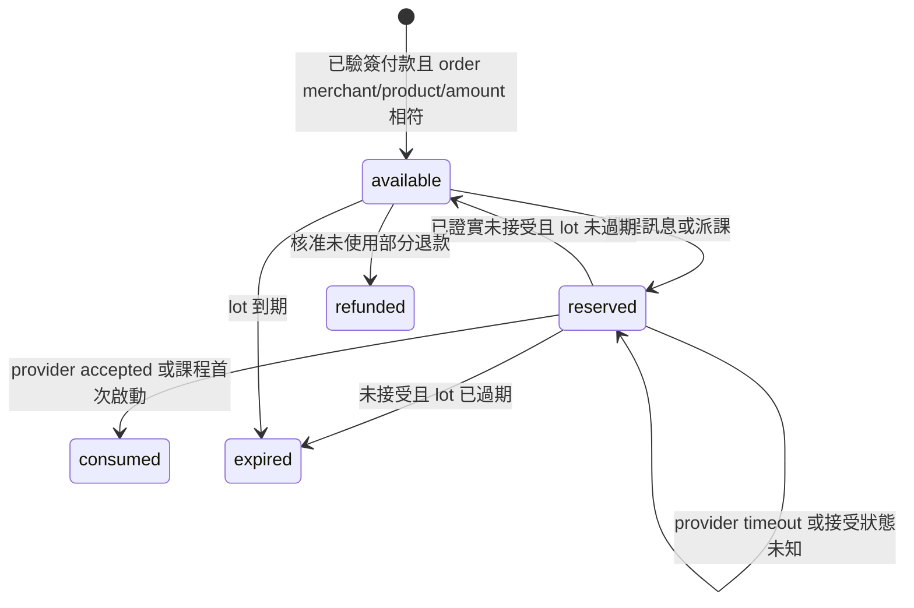

# 點數與服務額度政策／對帳手冊

`sandbox-2026-09-v1` 僅為可驗證本機契約，不是對客正式定價或稅務政策。官網未核定價目以詢價呈現。正式商店、發票、含稅與退款條款列於 activation checklist。

## 記帳單位

點數是整数。社交工程每個 planned message 預留 1 点；原創示範文字課程每個 enrollment 預留 10 点。訂單示範數量 100/500/1000；sandbox 金額每点 100 minor TWD，仅測金額一致性。付費 lot 與 gift lot 保存來源、用途、到期和版本；示範 gift 僅限 training。年度服務批次另有 entitlement ledger，完全不使用 wallet points。

Idempotency key 同 actor／operation／payload hash 重播只回原 receipt，改內容回 409。訂單由 server payment route 綁 tenant/product/merchant；不能靠 webhook body 的 tenant 自報歸屬。支付 HMAC 覆蓋原 body 與 timestamp，時窗 5 分鐘；重複、晚到 failed、錯額／幣別、refund-before-paid、chargeback 均有明確狀態。未知 mail 保留預留直到核對；到期不把未知錯當未寄。

## 操作

1. 財務在「帳務」確認訂單、已收、退款及 wallet ledger 差額；`/internal/billing/reconciliation` 應回 `matched`。差額時凍結調查，不能直接改 balance。
2. `/internal/billing/refunds` 只補償該筆訂單可退未使用点数與金額；部分退款可重播而不重複扣除。Invoice adapter 尚未啟用，重試發票不能重 grant points。
3. 未知寄送至 `/internal/phishing/messages`，查供應商回執後填 `accepted/rejected`、provider reference、實際接受時間與理由；accepted 消耗原預留，rejected 釋放。不得按「重寄」猜結果。
4. 服務批次建立／排程預留有限授權，首次發布耗用一批次；更正原批次不再次耗用；未交付取消 release；複測為独立批次與額度。追加授權需 PM 明示數量及理由，記入 append-only ledger。

已包含課程授權、真實發票／商店 reconciliation 和正式退費審批仍待接入核定政策，不宣稱已在 production 使用。可用點数不自動當作營收；Portfolio 的購点、耗用、GMV 和實收保持各自口徑。
