# 資料模型

實際型別／FK／constraints 以 `backend/kuanguard/models.py`、`portfolio.py` 和編號 migrations 為準。此圖只畫主要關聯，未省略的資料表可從 OpenAPI／schema SQL 追查。

```mermaid
erDiagram
    tenants ||--o{ memberships : authorizes
    users ||--o{ memberships : holds
    tenants ||--o{ projects : owns
    users ||--o{ grants : receives
    projects ||--|{ work_packages : contains
    work_packages ||--o{ batches : delivers
    batches ||--o{ scope_assets : versions
    batches ||--o{ imports : receives
    imports ||--o{ findings : normalizes
    batches ||--o{ snapshots : approves
    snapshots ||--|| report_jobs : generates
    report_jobs ||--o| publications : publishes
    batches ||--o{ retest_checks : verifies
    projects ||--o{ changes : negotiates
    projects ||--o{ acceptances : confirms
    projects ||--o{ entitlements : limits
    entitlements ||--o{ entitlement_ledger : accounts
    tenants ||--|| wallets : owns
    orders ||--o| payments : settles
    orders ||--o{ point_lots : grants
    point_lots ||--o{ reservation_lots : allocates
    reservations ||--|{ reservation_lots : holds
    point_lots ||--o{ wallet_transactions : records
    campaigns ||--|{ message_plans : schedules
    recipient_groups ||--o{ recipients : lists
    message_plans ||--o{ raw_events : observes
    courses ||--|{ lessons : teaches
    courses ||--|{ questions : assesses
    courses ||--o{ enrollments : licenses
    enrollments ||--o{ progress_events : tracks
    enrollments ||--o{ attempts : grades
    enrollments ||--o| certificates : completes
    questionnaires ||--|{ questionnaire_answers : reviews
    tenants ||--o{ portfolio_connectors : scopes
    users ||--o{ form_drafts : owns
    tickets ||--o{ ticket_messages : discusses
    courses ||--o{ training_entitlements : includes
    training_entitlements ||--o{ training_entitlement_ledger : accounts
    enrollments ||--o{ training_entitlement_ledger : uses
    tasks ||--o| task_details : versions
    tasks ||--o{ task_dependencies : depends
    projects ||--o{ meeting_decisions : decides
    projects ||--o{ project_cost_entries : costs
    tenants ||--o| dispatch_policies : configures
    tenants ||--o{ dispatch_qualifications : qualifies
    tenants ||--o{ dispatch_tools : allocates
    deletion_requests ||--o{ lifecycle_plans : reviews
```

Tenant tables 同時有 tenant filter、FORCE RLS 和 composite `(tenant_id, id)` references。sessions/memberships/jobs/inbox 等受信內部路由表不暴露前端直連；API app role 不是 DB owner、沒有 BYPASSRLS。點數、服務額度、snapshots/publications、稽核／排程歷史與 attempts 禁止 UPDATE/DELETE；更正使用新的紀錄。
