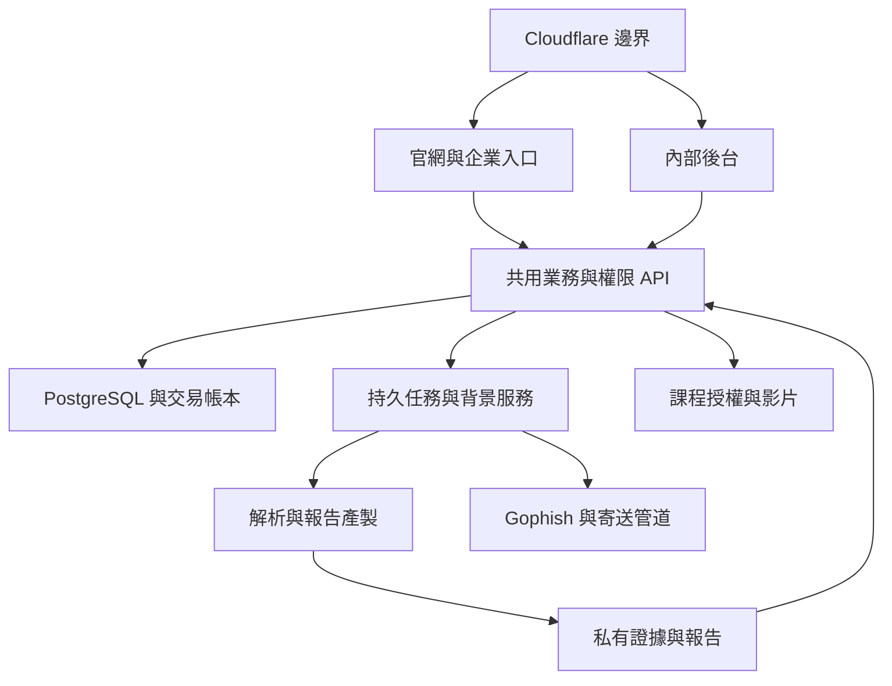

# KUANGUARD 官網與資安 SaaS 平台：Codex 一次性完整開發 Prompt

版本：1.0｜整理日期：2026-09-10｜語言：台灣繁體中文

## 使用方式與目前事實

將本檔全文交給具有專案程式庫存取權的 Codex 執行。這是一份完整實作指令與驗收規格，不是現有功能已完成、網域已接入或正式上線的證明。

已確認：公司網域為 **kuanguard.com**，使用者表示在 **GoDaddy** 購買；網域保留在 GoDaddy，DNS 與適用服務整合 Cloudflare。品牌暫用 **KUANGUARD**，法定公司名稱、商標、Logo、地址及正式服務價格依提供資料設定，不能自行宣稱公司已完成登記或取得認證。

目前未提供／未驗證：Cloudflare 帳號授權、GoDaddy 登入/API、完整現行 DNS、正式主機、最新版工具與 Gophish 程式庫、七項服務全部模板與正式教材。本規格內的網域分配是目標設計，並非現況紀錄。公開網址抓取失敗也不能據此推論網域不存在或尚未設定。

---

## 0. 你的任務與執行原則

你是本專案的產品、全端、資料、資安、QA 與部署工程師。請直接實作可運作、可測試、可維運的官網與平台，連續完成下列 Phase。先讀取現有 repo、AGENTS.md、部署設定與現成工具，保留可用架構，以可回復的變更逐步完成；不要只交規劃、靜態畫面或沒有後端的按鈕。

1. 將每項需求建立可追蹤 ID，記錄至 `docs/requirements-traceability.md`，對應路由、API、資料表、測試與完成證據。
2. 不要每個 Phase 結束都要求使用者再貼下一段。缺少設定時先完成不受影響的程式、測試與可審閱部署計畫，集中到 `docs/activation-checklist.md` 列出真正需要使用者處理的項目。
3. 缺少秘密、合約、授權或外部服務時，使用明確的開發 adapter／sandbox，標示未啟用；不得偽造付款、寄信、掃描、完課或發布成功。正式環境禁止 demo seed 與假登入。
4. 遵守環境本身的權限與核准要求；不可繞過 2FA、API 限制或審核。已有明確授權的例行實作不重複請示。正式 DNS 切換前必須具備可審閱差異、備份、驗證和回復步驟。
5. 新增付費訂閱、額外網域、工具採購或超出既定預算的服務，先完成選項與成本資料，再集中取得決策；不因需要採購而停止其他實作。
6. 不擅自改動無關 repo、現有郵件紀錄、其他網域或餐飲平台。尤其不得把 qidaigo.com 當作本專案網域。
7. 所有產出檔名使用英文、數字、底線或連字號。UI 與報告以繁體中文為主。正式營運時間預設 Asia/Taipei，資料庫時間使用 UTC 並保存來源時區。
8. 若執行環境有 Sites 管理的專案標記，遵循該環境的 Sites 建置／發布流程並保留專案身分；不得另建一套衝突的部署。否則採本文件可攜式容器部署。
9. 先盤點程式碼、模板與教材使用權。只納入使用者有權使用的內容，原客戶／原服務公司的名稱、Logo、歷史統計不得自動成為新公司預設資料。
10. 查詢各依賴當時的官方穩定版本，記錄版本與驗證日期，使用 lockfile；不得盲目使用 latest、beta 或為了追新重寫穩定核心。

## 1. 不可被後續實作改變的需求

| ID | 強制需求 |
| --- | --- |
| CORE-01 | 首波上線包含 VA、WVA/WEBVA、SHC、PT、源碼掃描、社交工程、線上教育訓練七項；SHC/PT/源碼不得移到日後才開放 |
| CORE-02 | VA/WVA/SHC/PT 由工程師到場檢測與採集，從公司內部後台上傳、處理、覆核、發布 |
| CORE-03 | 客戶入口沒有上述四項的原始檢測檔上傳、掃描器操作或「立即自動掃描」功能；API 也必須拒絕客戶角色上傳，不只是隱藏按鈕 |
| CORE-04 | 客戶可查專案時程、看已發布結果、下載正式報告、文字回覆修補、討論與申請複測；客戶修補證據上傳預設關閉，未另行授權不得擴張 |
| CORE-05 | 源碼掃描首波提供內部匯入、覆核、報告與複測；客戶原始碼交付方式仍待設定，預設不開放客戶端原始碼上傳或任意Git URL抓取 |
| CORE-06 | 社交工程是客戶可自行登入、購點、建立活動、管理受測群組、排程與看成效的服務，整合既有 Gophish 核心 |
| CORE-07 | 教育訓練在同一平台，企業可購點、派課，學員登入學習、測驗與取得完課證明 |
| CORE-08 | 社交工程與教育訓練共用企業點數錢包；用途、單價、付費／贈送批次與使用限制分開記帳；檢測次數／顧問時數等服務額度獨立 |
| CORE-09 | 社交工程不收集或儲存密碼；統一使用活動、受測群組、教育頁、補救訓練、風險指標等語彙 |
| CORE-10 | 單獨購買點數即可使用自助服務；年度合約、專案關聯是可選，不得強制先買年度專案 |
| CORE-11 | 原始檢測資料、內部筆記、成本及未發布發現與客戶正式結果分權分版本；一般學員不因能登入而獲得弱點報告權限 |
| CORE-12 | 所有報告與線上統計由同一已核定資料快照產生；AI 不決定統計或把證據不足判為安全 |
| CORE-13 | 七項全含的年度方案按服務範圍、頻率及額度訂價，不是無限量；價格未核定時顯示詢價而非虛構優惠 |
| CORE-14 | 官網、網站操作、結果查詢與營運管理線上整合；到場服務及專業人工覆核仍是正常業務流程，不以線上化為由改為無人掃描 |

## 2. 產品範圍與新增補強分級

### 2.1 首波完整功能

- 官網服務目錄、七服務詳情、年度整合方案、課程商城、詢價、示範樣本、信任與支援頁。
- 租戶、企業成員、部門、RBAC、企業登入、客服、通知、稽核及資料保存政策。
- CRM／需求、報價版本、合約／訂單、服務額度、年度專案、工作包、執行批次、現場派工、時程、交付／驗收、複測、成本與續約。
- 七項服務的真正可操作流程、報告與結果頁。
- 自助社交工程、LMS、共用錢包、購點訂單、支付與退款 adapter、對帳、異常修復。
- Cloudflare DNS／防護／適用檔案影片服務設定、部署、備份、監控與還原驗證。

### 2.2 同類平台啟發後納入的補強

| ID | 補強 | 實作邊界 |
| --- | --- | --- |
| ENH-01 | 年度服務日曆與持續改善總覽 | 首波完成；依合約排程到場服務，非自動遠端掃描 |
| ENH-02 | 客戶與工程師討論、待辦、工單與通知 | 首波平台內完成；外部工單/Teams/Email整合採adapter，憑證不足列待啟用 |
| ENH-03 | 可疑郵件回報與回報率 | 首波提供平台回報入口與演練事件模型；Outlook/Gmail外掛需另完成發布驗證，不宣稱已上架 |
| ENH-04 | SCA/SBOM/Secrets、容器/IaC結果 | 納入源碼工作包的可選子服務與匯入能力清單；未配置工具不自稱掃描支援 |
| ENH-05 | 雲端/M365、備份、帳號權限健診 | 納入SHC可配置檢核庫；首批有合法基準與樣本的項目上架 |
| ENH-06 | API安全、人工程式碼審查 | 納入PT/源碼子服務範圍與報價，不另複製租戶及報告系統 |
| ENH-07 | 供應商問卷、證據、到期重評 | 建立可用的問卷/證據/追蹤通用框架；未有服務交付能力前不設直接購買 |
| ENH-08 | 外部曝險監控、App/AI檢測、桌上演練 | 預留服務商品與adapter；有範圍、能力、授權及工具後再開放，不阻擋七核心首波 |
| ENH-09 | 信任中心與合規證據索引 | 顯示真實政策、服務狀態與可授權分享證據；不宣稱掃描等於認證 |

前述選配／擴充不准取代或延後七項核心。市場來源只用來理解功能，不抄第三方品牌、畫面、文案、客戶名單、證書或效能數字。

## 3. 架構與部署原則

### 3.1 優先沿用既有資產

先輸出 `docs/current-state.md`：repo、語言、框架、資料表、現有登入、Gophish客製、報告工具、雲端與DNS現況、技術債及可重用項目。找不到原始碼要明列，先完成adapter契約及整合測試替身；不可聲稱已完成舊系統遷移。

若無可用主平台，預設採以下可攜式架構並寫 ADR：

| 元件 | 預設設計 |
| --- | --- |
| 官網/客戶/學員/內部UI | TypeScript + React + Next.js穩定版；官網SSR/SSG、應用動態授權；共用design system，依host與權限分入口 |
| 核心業務API | Python FastAPI模組化單體，集中身份授權、PM、報告、點數、LMS與adapter；若現有後端穩定則沿用，避免雙份業務邏輯 |
| 資料庫 | PostgreSQL，交易、租戶隔離、遷移、唯一約束與稽核；帳務以DB為準 |
| 背景工作 | Python workers處理CSV/XML、文件、轉檔；Redis相容佇列作傳遞，DB持久job/outbox作事實來源 |
| 演練引擎 | 既有Go/Gophish獨立服務；由平台adapter存取，禁止將管理API key交給瀏覽器 |
| 物件儲存 | Cloudflare R2私有bucket；資料地域有契約限制時改用符合條件的供應商，不宣稱R2預設留台 |
| 影片 | Cloudflare Stream或已核准等效服務；付費影片需短效授權播放 |
| 邊界 | Cloudflare DNS、TLS、防護、選定rate limits與Turnstile；內部Access為額外保護 |
| 執行環境 | 支援Node/Python/Go的正式容器主機；Next standalone或既有相容部署，重工作不放HTTP長請求 |
| 外部服務 | 支付、電子發票、通知郵件、演練郵件、SSO、AI均有明確adapter契約及啟用狀態 |

不要為配合Cloudflare把PostgreSQL、Gophish、Office轉檔、SMTP工作硬搬進Workers。DNS接入不等於全部服務部署在Cloudflare。需要Workers時僅用於經驗證的邊界功能；若選OpenNext，另驗證相容性，不與預設Node容器混用隱藏假設。

### 3.2 資料流



所有同步/非同步流程都帶tenant、actor/service identity、trace、resource scope與idempotency identity，worker不能相信訊息內未驗證的tenant_id。API鑑權後才建立資料任務；worker再次確認任務狀態及來源關聯。

## 4. 網域規劃：kuanguard.com / GoDaddy / Cloudflare

| 主機名稱 | 用途 | 存取與快取 |
| --- | --- | --- |
| kuanguard.com | 主官網、服務目錄、詢價、課程介紹 | 公開；只快取公開內容 |
| www.kuanguard.com | 統一導向主網域 | 保留path/query的永久重新導向；避免循環 |
| app.kuanguard.com | 企業工作台、社交工程、點數、LMS；`/learn`為學員區 | 應用登入與租戶授權；敏感回應no-store |
| admin.kuanguard.com | 公司內部PM、派工、匯入與覆核 | Cloudflare Access加應用內登入/RBAC；host限制不是權限控制 |
| api.kuanguard.com | 外部整合webhook/API，如架構需要才建立 | 簽章/身份驗證、來源與速率控制；不快取 |
| assets.kuanguard.com | 公開Logo、官網圖與公開教材預覽 | 僅公開資料；絕不存私有報告 |
| notify.kuanguard.com | 通知郵件的驗證用子域（實際依供應商） | DNS驗證用途；保留原郵件紀錄 |
| sim.kuanguard.com | 僅在核准後作演練教育頁／事件收集 | 與管理系統隔離；不得共用主站session/cookie |
| status.kuanguard.com | 服務狀態頁，可選獨立狀態服務 | 不顯示客戶與內部系統敏感資料 |

名稱為目標規劃，必須先檢查衝突。任何A/AAAA/CNAME內容都來自實際主機供應商，不得用假IP或擅自覆蓋既有網站。演練子域不完全隔離根域聲譽；若採獨立演練網域，另列採購與核准，不自行購買。

### 4.1 實作Cloudflare自動整合工作流

建立 `infra/cloudflare/`、宣告式設定及 `scripts/cloudflare-onboard` 工具，包含 inspect、plan、apply、verify、rollback 子命令；選Terraform或官方API其中一種作設定事實來源，記錄provider版本，既有資源先import/reconcile。Terraform state加密、限制存取、遠端鎖定及備份，不放公開repo或一般交付附件；第二次plan不得出現無關變更。

1. **盤點：**查明GoDaddy只是註冊商或同時是目前權威DNS。透過現有權威DNS供應商匯出完整zone，保存NS、TTL、A/AAAA/CNAME/MX/TXT/CAA/SRV、子域委派、DNSSEC/DS。公開DNS查詢不能枚舉完整zone，Cloudflare quick scan也不是完整備份。
2. **帳號：**使用已授權Cloudflare帳戶或最小範圍API token；zone/resource範圍限定kuanguard.com。建立zone與日常DNS/Rules/R2/Stream/Access可需不同權限，按實際endpoint檢查，不要求全域API Key。
3. **準備：**若zone已存在則重用，核對account與zone ID；沒有才建立。先匯入保留紀錄，再提出新增/修改/刪除差異。不得整個zone replace，也不得讓IaC順便接管所有不相干資源。
4. **DNSSEC：**依舊DNS、GoDaddy parent DS與Cloudflare DNSSEC現況規劃遷移。確認舊DS不會指向不存在的key；按官方步驟處理舊DS、等待必要傳播，再切換，穩定後配置新DS並驗證。不可籠統永久關閉，也不可切NS後放著舊DS造成SERVFAIL。
5. **GoDaddy NS：**取得Cloudflare實際分配的nameservers後更新kuanguard.com委派；不轉移註冊商，不使用猜測的nameserver名稱。已具合法可用的GoDaddy API/瀏覽器會話則在授權範圍內完成；若登入/2FA/API資格限制則輸出可直接照做的名稱與步驟，讓使用者完成該必要動作，其他開發繼續。
6. **TLS：**先驗證origin TLS鏈與hostname，使用Full (strict)；不以Flexible掩蓋origin設定問題。若用Tunnel，依Tunnel機制配置安全origin連線，不重複套不適用的公開origin假設。
7. **Proxy：**HTTP資源依需求代理；郵件主機與供應商要求的驗證/特殊紀錄保留正確DNS-only方式，不把MX目標誤設成HTTP proxy。SPF依供應商既有紀錄合併，不能建立相互衝突的多筆SPF。
8. **防護：**用可用方案實作WAF、API速率、登入/詢價/購點濫用控制、Turnstile後端驗證、origin防直連。Webhooks不能被互動challenge擋住，也不能全域白名單繞過簽章驗證。WAF因掃描證據內含SQL/HTML觸發時，僅對核定內部路由及必要規則做最小調校；不可停用整站防護。HSTS在相關子域TLS與回復方案驗證後分階段設定，不直接開啟includeSubDomains或preload。
9. **敏感快取：**app/admin/API、受權下載、付款、演練事件no-store且edge bypass；不得對全站Cache Everything。公開網站與靜態hash檔才使用快取。
10. **Access：**僅保護內部後台/運維入口，origin驗證Access token簽章、issuer、audience與期限，應用後端也驗證角色；客戶app不能被員工Access policy封住。非瀏覽器callback與service token設計獨立路由，不設整個API bypass。
11. **驗證：**保存前後DNS差異、各權威NS與至少兩個解析器結果、DS驗證、zone active、TLS、www redirect、登入、已授權信箱的往返信與DNS驗證、webhook可達性。無信箱驗證權則誠實標待驗證，不擅自寄信給第三人。
12. **回復：**保留舊DNS運作到觀察完成；能回復個別managed record/rule、origin版本及NS/DS的相容組合。回復不是保證即刻生效，需列TTL與傳播影響。禁止刪除整個zone作rollback。

### 4.2 檔案、影片與演練邊界

- R2區分quarantine、原始檔、處理後證據、正式報告等私有資料；公開資產使用獨立bucket。R2 location hint不是資料必定留在特定國家的保證。
- 內部上傳由API驗證employee角色與專案權限後才核發短效、固定object key的upload grant；完成後驗證大小、hash、類型、tenant、job，再移出quarantine。
- 大檔採分段/續傳與background finalize，先查Cloudflare目前方案request size/time及origin限制，不假定所有檔案都能穿過單一HTTP請求。S3 multipart和HTML presigned POST不同，不假設R2支援後者；實作過期分段清理、容量歸還與重複finalize防護。
- R2 presigned URL依官方S3 API endpoint運作，不能把簽章URL的host直接換為自訂網域。需要自訂受權下載時建立驗證代理；重要報告若需即時撤銷則使用每次驗權代理，不宣稱已發出signed URL可單獨撤銷。
- CORS僅列必要origin，不設credentialed wildcard。檔案上傳簽章限制與CORS不能替代租戶授權；原始檔不放公開bucket。
- 付費影片簽章在驗證enrollment後取得，禁止免費預覽沿用完整付費片源。Stream啟用requireSignedURLs，字幕、播放token、origin限制依當期官方能力實作；影片上傳/轉碼/失敗狀態要可見，預設不開原始MP4下載。簽章不等於DRM或完全防錄影；無符合資料地域需求的方案則更換adapter。
- 演練頁與事件端點不執行任意自訂JS、不讀管理cookie；tracking token不可含明文Email且經簽章/隨機化。觀測原始事件需與人類行為判定分開。
- 通知寄信與演練寄信使用分開的設定及額度。不能把入站Email Routing轉寄設定當成SMTP。Cloudflare Email Service功能與方案會改變，若採用先查當期官方文件與用途條款；不得假定新/beta寄送服務可用於演練。

## 5. 身分、角色、租戶與可見性

採成熟OIDC/SAML/Passkey/MFA方案，優先沿用可用IdP。企業登入可提供Google/Microsoft或客戶企業SSO；具體provider在啟用設定確定。不得直接移植餐飲平台的LINE/Apple需求作本公司必要條件。只有已啟用且驗證的登入選項才顯示；開發用角色切換不得存在正式環境。

| 角色 | 可做 | 不可自動取得 |
| --- | --- | --- |
| 平台設定管理者 | 系統設定、帳戶健康、服務商品 | 所有客戶完整證據；支援存取需限時、有理由與稽核 |
| PM／業務 | 客戶、報價、合約、時程、派工、公開進度 | 未授權的詳細原始碼/個人演練結果 |
| 工程師 | 被指派案件的匯入、發現、證據、內部記錄 | 其他客戶／未指派案件、財務調帳 |
| 覆核／發布者 | 檢查與發布指定服務結果 | 默默覆寫已發布版本 |
| 財務 | 訂單、付款、點數、退款、發票對帳 | 演練個人結果／漏洞證據 |
| 客戶企業管理者 | 企業成員、服務、授權角色 | 所有部門/子公司敏感資料，需按權限明示授予 |
| 客戶專案窗口 | 本專案公開進度、正式結果、回覆、複測 | 檢測原始檔上傳、內部筆記與草稿 |
| 客戶演練管理者 | 活動、群組、排程及授權範圍成效 | 購點、平台總管理、非其範圍的個人結果 |
| 客戶訓練管理者 | 派課、完成率及被授權成績 | 工程師上傳、公司全部弱點 |
| 客戶購點管理者 | 購點與企業帳本 | 自動取得測試/訓練管理權 |
| 部門主管 | 所屬部門彙總、訓練完成狀態 | 預設查看全員受測明細 |
| 學員 | 我的課程、測驗、證明、自己的通知 | 企業錢包、受測名單、弱點報告 |

- 租戶ID來自已驗證membership與scope，不信任body/query帶入的tenant。
- DB、object key、查詢、搜尋、匯出、任務、cache、webhook mapping都要隔離；UUID不可代替授權。
- 集團/子公司以顯式grant彙總，禁止Email網域相同就自動跨公司共享。
- 限時外包/支援access到期失效；離職撤銷session、API key與角色但保留稽核歸屬。
- session cookie使用host-only、Secure/HttpOnly/合理SameSite，不能設共用`.kuanguard.com`讓sim子域收到；CSRF與Origin校驗依互動模式配置。
- 邀請、SSO回呼、帳戶連結、Email變更都需防接管；建立tenant與認領企業要有明確驗證。

## 6. UI/UX 設計系統

### 6.1 品牌與視覺

品牌顯示：`KUANGUARD`，中文副標「企業資安服務平台」。法定名稱未核定前不自行翻譯成註冊公司名稱。

- 調性：專業、清楚、可信賴；避免駭客面罩、綠色程式雨、恐嚇口號與大量無意義動畫。
- 官網：深海軍藍主視覺搭配白色內容，青綠點綴與低飽和背景；圖像以真實產品畫面、服務流程、排程與報告縮圖為主。
- 應用：明亮白底為預設，深色側欄、小面積品牌色，強調閱讀表格、排程、證據與報表效率。
- 初始tokens：`brand #0B1F33`、`primary #0F766E`、`surface #FFFFFF`、`canvas #F4F7FA`、`text #172B4D`、`muted #52657B`、`border #DCE4ED`；每個文字/背景組合實測對比，不把token視為已自動達標。
- 風險嚴重紅／高橘／中藍／低綠，必須同時有文字與icon；狀態色不等於風險色。報告顏色以模板為準。
- UI中文用具合法來源的Noto Sans TC或核准字型，英文/數字用Inter或系統字型；報告保留標楷體/Times New Roman既定規則。
- 8px間距、桌面約240px側欄、內容最大寬度約1440px，表格支援虛擬化、欄位選擇與保存篩選；不強迫大資料一次載入。
- 桌面1440、平板768、手機390寬驗證；手機保留查詢、回覆、付款與學習，複雜工程師表格用受控水平捲動，整頁不溢出。
- 以WCAG 2.2 AA作產品驗收目標，鍵盤操作、焦點、標籤、錯誤提示、字幕與reduced motion需可測；尚未評估前不在官網宣稱認證。

### 6.2 所有頁面的共同要求

1. 完整loading/empty/error/no-permission/expired/partial-success/retry states；錯誤帶可追查編號，不洩露stack或客戶資訊。
2. 表格批次操作先顯示選取範圍，避免只處理目前分頁卻宣稱全選；重要變更提供預覽與結果摘要。企業切換時清楚顯示名稱，取消舊企業未送出的操作，清除舊scope資料/cache，重新驗權。
3. 日期明示時區；價格、點數、席次、活動訊息數等單位不可混用。
4. 畫面顯示資料更新時間、報告版本與覆蓋率；沒有資料顯示「尚無結果／未檢測」，不顯示綠色安全分數。
5. form dirty提示、可恢復草稿、autosave衝突處理；建立活動、派課、付款、發布需具idempotency。
6. 關鍵行動在頁首清楚呈現，一頁主CTA不超過必要數量；內部API狀態不要佔據客戶產品流程。
7. 數字圖表附口徑與可讀表格。不可產生虛構客戶Logo、證書、成交數、弱點改善率或testimonial。

## 7. 官網資訊架構與畫面

| 路由 | 畫面與功能 |
| --- | --- |
| `/` | Hero、七項服務、工程師交付/自助服務流程、年度方案、平台預覽、信任內容、FAQ與CTA |
| `/services` | 七項服務目錄與適用對象篩選，清楚標示「工程師交付」或「線上自助」 |
| `/services/va` | 主機檢測範圍、到場準備、輸入/交付物、複測與詢價 |
| `/services/wva` | 網站與角色範圍、AppScan結果、路徑分析、初複測 |
| `/services/shc` | 健診設備/基準/證據/改善項目，不把健診等於合規認證 |
| `/services/pt` | 測試標的/方法/授權/證據/人工覆核/交付 |
| `/services/source-code` | 支援語言與工具能力清單、來源處理、SAST與選配項目、詢價 |
| `/services/phishing` | 客戶自助活動、點數計費、教育頁、成效/補救、受控試用 |
| `/services/training` | 購點派課、員工學習、測驗、證明、成效 |
| `/plans/annual-security` | 七項全含年度方案、每項額度欄位、交付範圍、追加方式、專案詢價 |
| `/courses`、`/courses/[slug]` | 課程搜尋、語言/對象/時長、章節預覽、點數與授權期限、企業派課入口 |
| `/pricing/credits` | 點數包、社交工程/課程計費說明、單價生效版本、退款/到期規則 |
| `/request-quote` | 公司/窗口/服務/粗估範圍/期望日期/文字需求；無檢測檔上傳 |
| `/resources` | 經覆核文章、教材試看、去識別化報告樣本 |
| `/trust` | 真實資料政策、子處理者/區域資訊、資安聯絡、證據申請與狀態頁 |
| `/about`、`/contact` | 真實公司資料與客服時段，未確定欄位不公開假資料 |
| `/legal/*` | 隱私、平台服務、點數/課程、可接受使用與資料處理版本 |
| `/login` | 導入app登入；依身份導向工作台或學習區 |

首頁Hero可用原創文案：「讓企業資安，從檢測到改善都有紀錄。」副文說明整合七服務、報告、時程與訓練。主CTA「規劃年度資安服務」、次CTA「進入線上演練與訓練」。每服務頁說明適用情境、範圍、準備、流程、交付、複測、資料處理與購買入口。

SEO僅對公開官網：canonical=https://kuanguard.com、sitemap、robots、真實metadata與結構化資料；app/admin/結果/學員資料禁止索引且需授權，robots不是安全機制。公開示範以合成/去識別化內容標示「示範資料」。沒有實際服務能力與定價的擴充服務只能顯示諮詢或不公開，不能假裝可直接購買。

## 8. 客戶與學員介面

### 8.1 客戶企業工作台：app.kuanguard.com

| 路由 | 必須呈現與可執行行動 |
| --- | --- |
| `/dashboard` | 年度七服務進度、近期已確認行程、已發布風險、待回覆、演練/訓練摘要、授權可見點數與到期提醒 |
| `/projects` | 搜尋年度/服務/狀態/窗口；每案有公開進度與下一里程碑 |
| `/projects/[id]` | 頁籤：總覽、服務範圍、時程、結果、正式報告、改善、討論、交付驗收；無原始檔上傳tab |
| `/calendar` | 檢測、交付、複測、演練、訓練截止；只顯示客戶已確認時程；提供安全日曆匯出 |
| `/assets`、`/findings` | 搜尋授權範圍的資產/弱點/服務/嚴重度/狀態，顯示來源批次、報告版本、覆蓋說明 |
| `/findings/[id]` | 已發布說明、遮罩證據、改善建議、負責人、期限、文字討論、待驗證、申請複測 |
| `/reports` | 已發布版本、日期、服務/批次、取代版本標示、線上閱讀/下載；留存下載與授權audit |
| `/phishing/*` | 客戶自行活動、群組、模板、排程、結果與補救訓練，見第14節 |
| `/training/*` | 課程目錄、派課、學習計畫、部門成效、證明，見第15節 |
| `/wallet` | 可用/預留/到期點數、付費與贈送批次、用途明細、購點、訂單、退款狀態 |
| `/quotes`、`/contracts`、`/orders` | 已授權客戶查報價版本、接受或回覆意見、閱讀有效合約/訂單與下載文件；線上確認記錄操作者、版本、時間與意圖，正式電子簽署以已核准provider及條款實作 |
| `/projects/[id]/changes` | 查看追加範圍、原/新費用、額度與時程影響，接受/退回意見，確認後才生效；不改寫舊合約快照 |
| `/services` | 已購檢測次數、顧問時數等服務額度，和wallet點數分開 |
| `/organization` | 部門、成員、角色、邀請、停權與預算；有權人才可操作 |
| `/support` | 建立文字工單、查詢回覆、標示服務時段；不變相提供檢測檔上傳 |

Dashboard不把弱點數、SHC通過率、點擊率、完課率加成一個難解釋的「安全總分」。每個指標可點開來源與口徑；演練事件可即時顯示供活動管理者使用，不套用工程師報告草稿的可見性規則。

### 8.1.1 自助企業首次開通

`/onboarding`：登入 → 建立或加入企業 → 驗證企業及管理權 → 選擇購點/既有方案授權 → 設定演練或派課 → 完成首個活動。已屬企業的人走邀請或加入申請，不因相同Email網域自動取得權限；一人管理多企業時每次操作顯示當前企業。先選教育可完成購點學習而不被尚未配置SMTP阻擋；選演練則要求相應寄送與受測範圍設定。購點完成後保留原本選課/活動草稿，避免交易後迷失流程。

### 8.2 學員：app.kuanguard.com/learn

首頁只呈現我的待修課、即將到期、續看與已取得證明。課程頁含影片、字幕、章節、教材、完成條件與測驗入口；測驗顯示送出確認、重考規則，結果頁有授權的解說。證明可下載且查驗碼不公開全名/Email等多餘個資。手機版可完整完成課程與測驗。受測者與學員不必成為企業管理者；受測名單匯入也不自動建立管理帳號。

## 9. 公司內部後台：admin.kuanguard.com

| 路由 | 介面與職責 |
| --- | --- |
| `/overview` | 未指派案件、今日到場、待覆核、延誤/待客戶、交付與點數異常，按角色呈現 |
| `/customers` | 客戶360：窗口、合約、歷年七服務、資產、工單與授權可見帳務 |
| `/crm`、`/quotes`、`/contracts` | 商機、需求、報價版本、範圍附件、簽認紀錄、年度服務權益 |
| `/projects`、`/projects/[id]` | 工作包/批次、範圍、任務、甘特、風險與議題、討論、交付、驗收、成本 |
| `/dispatch` | 工程師技能/工作量、日曆、設備/工具授權容量、交通緩衝、衝突檢查 |
| `/imports` | 檔案選擇、tenant/project/batch確認、續傳、quarantine、解析預覽、欄位/版本、錯誤與範圍差異 |
| `/review` | 原始證據對照、誤判/去重/風險覆核、統計差異與核定快照 |
| `/reports`、`/templates` | 模板版本、動態欄位映射、產製工作、逐頁預覽、QA摘要、發布/勘誤 |
| `/shc`、`/pt`、`/source` | 專屬檢核/發現/掃描結果管理，不強迫共用不適合的欄位 |
| `/courses`、`/question-banks` | 正式教材/字幕/題庫版本、上架、停售、版權紀錄、課程費率 |
| `/phishing-operations` | 供應商健康、已授權寄送設定、濫用通報、支援案件，不預設查看所有個人明細 |
| `/billing` | 對帳、退款、支付異常、點數調整、服務額度、發票與成本毛利 |
| `/integrations` | adapter能力、憑證到期、連線健康、同步紀錄、重試/停用 |
| `/audit`、`/settings` | 限權稽核查詢、服務商品/政策/角色/保存期限、系統健康 |

內部上傳不是一般客戶前台加一個管理按鈕；須有獨立操作權、審查狀態與私有檔案存取。檢測原始檔只能內部API簽發上傳授權。客戶演練名單上傳是不同的業務類型與端點，不可誤被「客戶無檢測上傳」規則一併禁止。

## 10. CRM、專案管理與年度履約

### 10.1 分層與必備記錄

客戶 → 合約/訂單與服務權益 → 專案 → 七服務工作包 → 執行批次 → 任務/交付物。單次委託可不屬年度合約；自助活動/課程計畫可獨立並選擇關聯專案。每次初測、複測均有獨立ID與來源關係。

每個服務批次記錄：scope版本、預定/實際/已計費範圍、工程師、覆核者、客戶窗口、到場地址、前置條件、原訂/最新預計/實際時間、timezone、milestones、等待/延誤原因、交付物與版本、複測資格、用量、驗收、成本、問題與變更單。

### 10.2 工作流

- 商機：新需求 → 評估 → 報價 → 客戶確認/未成交。
- 合約：草稿 → 審閱 → 生效 → 到期/終止；訂單/付款狀態獨立。
- 執行批次：待準備 → 待排程 → 已確認 → 執行中 → 資料整理 → 待覆核 → 待發布 → 已交付；可暫停/取消，保留理由。
- 報告：草稿 → QA失敗或待覆核 → 核定 → 發布 → 被更正版取代；不得直接UPDATE覆蓋正式內容。
- 修補：待處理 → 處理中 → 客戶回覆已處理 → 待驗證 → 已修復/仍存在/無法判定；風險接受與誤判有獨立審核理由與到期日。
- 驗收：待交付 → 待驗收 → 意見退回/部分驗收/已驗收；下載不等於驗收。

七工作包可分批交付驗收，不因其中一項完成而結束年度合約。專案履約、技術修復、驗收、收款、點數結算及課程完成不能合成一個完成旗標。

### 10.3 時程、到場與變更

1. 專案啟動資料：授權、範圍、窗口、現場進出、測試帳號、安全設定、可執行時段、設備與工具授權、緊急聯絡與停止條件。
2. 任務依賴：資料齊備/到場前確認 → 執行 → 上傳 → QA/覆核 → 發布 → 修補/複測。延遲時呈現影響里程碑，保留原承諾後由負責人確認新時程。
3. 日曆支援工作日/假日/時區，服務計時何時暫停依合約版本，不自行套用無限等待。
   客戶只能提出改期需求，不能直接覆寫工程師派工日曆；確認者核定後更新客戶可見時程。
4. 排程同時檢查技能、人員、覆核者、設備、工具容量與交通緩衝，拖曳改期需展示衝突與記錄。
5. 現場紀錄支援草稿、待辦、實際範圍與阻礙；若提供離線功能，敏感證據不得無期限留瀏覽器，需另評估裝置與加密政策。
6. 新增IP/URL/角色/設備/源碼範圍走change request：差異、費用、交期、提出者、確認者、生效版本。原範圍與新範圍可回查。
7. 複測資格記錄次數、原發現範圍、申請及完成期限、起算規則；不把資料缺失判已修復，也不默認無限免費。
8. 服務額度有reserve/use/release/adjust，取消或改期按政策釋放；不可修改餘額掩蓋歷史。
9. 專案議題、會議紀錄、決議與待辦關聯到scope/報告/日期，客戶可見文字與內部筆記分欄、分權限。
10. 緊急弱點走適當技術覆核後的單項發布與通知、收悉追蹤，無需等待整份報告；不得把未核實內容直接公示。
11. 年度總覽提供剩餘服務、下次執行、資料過期、風險接受到期、複測截止、未完成訓練及續約提醒。
12. 工時與成本含到場/交通、分析、覆核、複測、工具/雲端/外包；顯示估計與實際毛利，僅財務/授權PM可見。

## 11. 標準化檢測資料與報告引擎

### 11.1 資料生命週期

內部上傳 → quarantine/檔案驗證 → parser識別版本 → 欄位與範圍預覽 → normalize → 去重/排除候選 → 工程師與覆核 → 核定snapshot → 同一snapshot產製所有格式 → 結構QA/視覺QA → 發布。

每次匯入記錄來源hash、大小、parser/schema版本、原始筆數、解析失敗、排除、有效筆數、範圍差異。重傳同檔不重複增加弱點或扣服務額度；不同批次可合法使用相同原始檔但必須顯式關聯與有用途。

資料至少拆為 Asset、AssessmentRun、Coverage、FindingDefinition、FindingOccurrence、Evidence、Disposition、ReportSnapshot。用穩定資產ID處理IP變動；同Plugin ID不同資產/port或同網站不同位置不誤去重。

snapshot包含source IDs/hash、normalized dataset版本、scope版本、parser版本、處理規則、翻譯/知識版本、模板版本、覆核者、時間、統計口徑及manifest。發布一個bundle時確保各檔版本一致，不讓部分新/部分舊。

### 11.2 VA/WVA輸入與規則

- VA：`.nessus`、Nessus CSV、IP/設備清單、ProjectSetting.xlsx。
- WVA：HCL/IBM AppScan XML、既有all.csv、URL清單、WVA範圍與數量設定。parser要公布支援版本，未知版本明示錯誤或預覽映射。
- 共用對應：Plugin ID→弱點編號、host→IP、Risk→風險等級、Name→弱點名稱、Description→弱點說明、Solution→修補建議。
- Critical/High/Medium/Low→嚴重/高/中/低；Informational/None保留來源但排除四級弱點統計，絕不改成Low。來源未有CVSS/CVE/CWE/修補版本不可杜撰。
- 資料基準：當次使用者明定/專案規則優先；VA同時有Nessus與CSV時沿用既有CSV優先規則，記錄差異與簡短說明，不能用模板舊數字覆蓋。
- 區分弱點種類數、實例數、受影響資產數；各指標API回傳口徑與資料版本。
- 本次完整預定範圍、實際完成範圍、未測/失敗範圍都要保留；零finding不等於檢測完成。
- IP:port正規化；IPv6有port時用不歧義格式；未知port不猜測。
- WVA保存URL/path、HTTP method、參數/位置與來源issue ID；展示時遮罩敏感query，不因顯示遮罩改壞去重依據。
- SSL保留/排除、QNAP/vCenter合併、誤判、版本查核都屬有版本的專案規則。歷史82/340/1423/273等數量不得硬編碼；三項SSL Plugin ID也不得成為全域排除清單。
- 複測匹配使用穩定資產、來源弱點ID、port/位置、scope與檢測方法。狀態包含新增/仍存在/已驗證修復/再次出現/未覆蓋/無法判定；僅原本範圍完成且有充分驗證才認定已修復。
- 風險接受/確認誤判與已修復分開，保留理由、證據、期限與覆核。

### 11.3 輸出清單

| 輸出 | 內容 |
| --- | --- |
| VA初測/複測 DOCX/PDF | 掃描範圍、風險統計、前十大、弱點明細、修補、初複測差異 |
| WVA初測/複測 DOCX/PDF | 網站範圍、四級統計、受影響系統、路徑與改善 |
| VA/WVA PPTX/PDF | 結果摘要、嚴重/高風險、IP:port或網站路徑、修補重點 |
| 主機統計 DOCX/XLSX | 依總數排序、四級色彩、總計末列、零finding資產依範圍規則呈現 |
| 弱點明細/根因 DOCX/PDF | 每弱點獨立表格，原因、影響、修補/緩解 |
| all.csv、summary.xlsx | 標準化明細與可重算彙總 |
| 複測追蹤 XLSX/CSV | 初測關聯、狀態、證據、未覆蓋；內部排除audit獨立權限 |
| XML衍生輸出 | 僅有已支援schema與明確用途時產生；不冒充原掃描器原始檔 |
| SHC/PT/源碼報告 | 各自資料模型、模板、初複測/改善結果；不套VA數據語義 |
| 社交工程/訓練報告 | 活動、母體、投遞/行為判定、部門趨勢、補救與學習成效 |

### 11.4 模板精準度

1. 以最新核准模板保留header/footer、頁碼欄位、TOC、style、固定段落與表格框線；placeholder/highlight/表名/欄名定位，不假設第N張表永遠同含義。
2. 預設中文標楷體、英數Times New Roman、正文14pt；特殊章節覆寫。字型缺失回報QA，不能偷偷替换後宣稱一致。
3. VA範圍表包含所有本次主機；專案成員工作職掌靠左；主機統計與IP對照色彩一致；每弱點分表；結果建議列高依模板如24pt，表頭置中。過長內容須按模板規則續頁而非截字。
4. WVA包含Critical；摘要分析12pt；受影響系統/路徑清單10pt；Solution去重形成強化建議；四級空段保留N/A；目錄和章節同步。
5. PPT嚴重/高頁標題26pt，主要Description/Solution/IP24pt、其他18pt，中文微軟正黑體、英數Times New Roman，實心圓點與1.5倍行距；表寬約29cm/內容27.2cm以實際模板為準。內容多時續頁，未指定投影片不得改動。
6. 清除完成填入區highlight，不動其他固定內容；保留模板專屬設定但將舊公司品牌改成使用者核准資料，不複用歷史機密聲明名稱。
7. Word/PPT內容產製與PDF轉換分開worker。先以代表性模板做spike選引擎，完整渲染逐頁檢查，驗證TOC/頁碼、框線、字型、溢出、空頁與跨檔數字。
8. 單位測試驗數據；視覺快照與實際文件人工抽查驗版面。正式模板首次/升版需逐頁QA；一般批次保留自動全頁檢查與覆核入口。

## 12. SHC 與 PT

### SHC

資料：ChecklistVersion、CheckDefinition、Applicability、ExpectedValue、ObservedValue、Evidence、CheckResult、Reviewer。判定通過/不通過/不適用/未檢測/證據不足，缺資料不可算通過。合格率明定分母，另外展示覆蓋率；風險與符合狀態分欄。

內部提供檢核庫/Excel匯入/採集資料adapter、逐項證據、批次填寫、異常原因與覆核；每次健診保留基準版本。候選類別包括資產版本、Windows/Linux、AD與權限、網路設備/防火牆、端點、日誌、備份還原、M365/雲端；以首批實際基準及樣本啟用。不要把未提供的基準檢核內容自行虛構成客戶已購服務。

### PT

內部工程師管理scope、授權文件、方法、帳號角色、測試時段、停止條件、測試case、發現、風險向量/理由、前置條件、重現步驟、影響、修補/緩解、遮罩證據與人工覆核。帳密保管在秘密管理工具，專案筆記只存reference。

WVA/VA與PT發現可以關聯但不直接合併來源證據；顯示關聯原因與避免重複彙總的口徑。重現步驟是授權報告的一部分，不能產生公共攻擊功能或在客戶入口提供任意目標執行。

## 13. 源碼掃描

- 首波內部匯入掃描結果與程式碼包（若已核准），支援能力清單逐項列工具/版本/語言/schema。優先實際樣本adapter，SARIF等通用格式依可用來源選擇。
- 記錄repo、branch、commit、工具/規則版本、掃描配置、掃描覆蓋/排除路徑、依賴版本、檔案位置、finding fingerprint、資料流與遮罩片段。
- SAST為核心；SCA/SBOM/Secrets/Container/IaC按子服務及額度呈現。Secrets只儲存必要遮罩、fingerprint與位置，避免將金鑰完整複製到報告與log。
- 比對版本要處理檔案改名/行號位移；不能只比行號就判修復。未建置成功、規則關閉、路徑排除都不可當弱點歸零。
- 原始碼執行/建置在隔離、有限資源、預設無不必要網路的worker；不執行匯入專案的任意hook於主服務。若未需要build則不執行。
- 客戶資料不送公共掃描網站；企業端掃描只回傳結果可作adapter選項。Git整合未取得host/repo allowlist和權限時不啟用。
- 產出初複測DOCX/PDF、開發者修補XLSX、管理摘要；敏感片段顯示按角色控制。

## 14. 客戶自助社交工程：Gophish 整合

### 14.1 整合與隔離

盤點既有Go版本、套件、fork與客製功能，升級到經確認的穩定工具鏈，保留投遞核心與資料遷移。禁止假定原生Gophish天然具備本SaaS的企業隔離、錢包或SSO。

平台adapter對應tenant/project/campaign/recipient IDs，瀏覽器只使用平台API。若原引擎無法證明共用實例能隔離，採每租戶引擎/資料隔離的可管理方案，直至測試證明可安全共用。管理埠只在私網，密鑰入vault；模板、收件人、附件、事件、匯出、背景任務均驗證範圍。

支援平台SMTP/API與客戶企業SMTP/內部relay兩條路徑。企業內網可用受控connector主動連出；不要求公開內部SMTP。不自行發信給未確認名單，不把寄送憑證暴露前端。

### 14.2 客戶建立活動精靈

1. 活動名稱、目的、關聯專案（可空）、時區、管理者。
2. 選受測群組：客戶可匯入名單CSV/XLSX，驗證Email/部門、去重、無效列預覽；受測者ID與學員/登入身份分開關聯。
3. 選已核准郵件模板、教育頁、語言、寄件設定；預覽與只送指定測試信箱的測試模式。
4. 設定寄送窗口、分批速率、截止、觀測期，展示已驗證寄送管道與收件範圍。
5. 選補救課程、觸發條件、企業預算；可手動確認或按已授權政策自動派課。
6. 確認實際收件訊息數、費率版本、預留點數、退信/取消政策與寄送內容。正式啟動由被授權客戶管理者確認，不強迫每次找公司人工操作；需額外審批的企業可自行設定。
7. 活動頁顯示排程、預留、寄送/觀測/完成、暫停/取消、投遞異常、可匯出結果與補救進度。

### 14.3 事件、指標與限制

- 不收密碼，不在教育頁提交或持久化password欄位；legacy capture功能預設停用並測試其無法接收敏感輸入。教育頁可作辨識練習但不得收集真實憑證。
- 原始事件有type、provider ID、source、occurred/received timestamp、判定版本；開信像素/連結掃描不直接當人類操作，提供bot/security gateway候選與覆核。
- 定義planned、provider accepted、delivered（只有供應商有證據）、bounced、clicked candidate、confirmed human interaction、reported、training assigned/completed的分母與時間窗口。
- 主管看部門趨勢；被授權管理者看個人補救名單。活動樣本量與難度不同時明示不可直接比較，未覆核bot資料不拿來懲罰排名。
- 回報入口只處理必要資訊；真實郵件樣本若另提供上傳必須獨立安全流程與授權，不把附件開啟執行。
- 測試訊息、正式訊息、重試與人工補寄有不同identity；補寄是否計費明示。取消只停止尚未送出的訊息，不能宣稱已寄出郵件可收回。
- 活動觀測關閉與帳務完成分開；late bounce/event按政策處理，歷史資料不覆寫為不同結論而無版本。

## 15. LMS 線上教育訓練

- 課程、章節、影片、字幕、教材、題庫、測驗規則、完課證明、授權期限與價格各有版本。首波至少一套真實完整課程可跑通，正式可售清單只能含可交付教材。
- 企業可自行購點/派課，依個人、部門、群組、CSV名單建立學習計畫，先驗證重複有效授權與點數預算。派課不是自动grant管理權。
- 授權來源包含付費點數、年度方案內含、贈送、人工核發；同一需求優先使用適用既有權益，不能兩邊重複扣。
- 採伺服器驗證的進度/課程啟動與測驗結果，不信任client傳來completed=true；考量正常播放、續看、可及性與合理重試，不蒐集不必要監控資料。
- 課前/課後、隨機題、次數/及格/重考/解答可見時機、學員補考與異常提交需完整狀態。題目與答案不可一次全送到未授權客戶端。
- 年度重訓是新enrollment/cohort，舊完課不抵新年度要求；課程升版處理現有授權與歷史證明，不因新版題目抹除舊成績。
- 新進/離職/調部門流程保留歷史、撤銷未來存取並釋放符合政策的預留點數；改Email不失去歷史或重複購課。
- 課程到期、下架、替代課、退款、已啟動授權處理依版本政策；第一批正式教材需可用與有權使用。
- 提供部門完成率、逾期、時數、前後測與證明；課程完成與實際技能驗證用語分開。
- 建立外部LMS教材/紀錄adapter契約，SCORM/xAPI先做能力評估與樣本測試；沒有實作不能顯示已支援。

## 16. 共用企業點數、服務額度與金流

### 16.1 帳本模型與不變條件

Currency金額以最小單位整數記錄；點數用整數，禁止float。RateVersion、PointLot、WalletTransaction、Reservation、Consumption、Adjustment/Refund、Order/Payment/Invoice分開。

- 可用點數＝所有當下適用lot可用量扣除有效reservations；展示可用/預留/已用/即將到期，不只一個balance欄位。
- lot有來源訂單、付費/贈送、適用服務、有效政策、耗用順序（如先到期先用）與原始金額分攤。贈送受限制點數不能因共用錢包而變成任意用途。
- 預留、扣點、釋放、回沖使用原子交易、行鎖/序列化與唯一業務鍵。不同租戶/活動併發不能超扣。
- append-only交易與平衡分錄/可重算projection，不DELETE舊ledger或只改balance；退款是補償交易，保留對原付款/消費的關聯。
- idempotency key加payload hash，同key不同內容回衝突。reconciliation持續核對payment、wallet、reservation、message、enrollment，不用Redis當帳本。
- 檢測次數/顧問時數/年度席次的EntitlementLedger獨立，與錢包可關聯但不混加。
- 點數有效期、可退金額、稅務/發票時點需有核定business policy；demo可測試，但不能將未確認條款直接對外銷售。
- 預留不默認延長點數效期。實作reservation期限、point lot到期、排程日期、首次啟動及延期重算的版本化政策；未核定時sandbox採保守策略：不得預留到lot有效期之後，改期跨期限需重新選適用點數，取消釋放到已到期lot不得重變可用。已送出但回執晚到的對帳需依可驗證provider時間和已凍結政策處理，不讓背景expire job與consume雙重處理；正式條款須核定後啟用。

### 16.2 社交工程扣點

收費單位預設「每位收件者×每封正式演練信」，單價可配置。排程reserve；provider確認accepted後consume。accepted不等於delivered，前台用詞必須正確。每個planned message有穩定ID。

寄送結果分類：未送/已確認接受/確認未接受/未知。未知時保留狀態、provider reference和預留，先對帳；SMTP不一定提供端到端exactly-once，無法確認時不能盲目重寄並宣稱保證不重複。支援人工核對及有紀錄的後續決策。

取消與永久失敗在未接受前release；已接受後的bounce依凍結費率政策回沖或不退，購買與啟動前清楚呈現。外部操作無法與DB同一transaction，採outbox/inbox+狀態機+saga補償，故障注入測試不可省略。

### 16.3 教育扣點

派課reserve、首次啟動課程consume；授權期內重看不重扣。尚未啟動可取消/到期release；同一學員已有適用授權時不得重扣。年度重訓與新課明確視為新授權。啟動失敗與扣點需有一致性補償。

### 16.4 購點與帳務

- 信用卡/企業匯款為首波候選，其他支付透過provider核准能力啟用。支付與發票adapter分開；不把某支付品牌可用當成全部付款方式已開通。
- 金流回呼驗簽、核對商店、訂單、金額、幣別及狀態；前端return URL只顯示查詢結果，不能作入點依據。
- 重複、亂序、延遲webhook、部分退款、chargeback、金流成功DB失敗都要測。已消耗點數的付款爭議進入欠款/凍結與人工處理政策，不回刪歷史或讓無關客戶受影響。
- 匯款由有權財務核帳後建立grant，附來源與理由；manual adjustment與大額退款可配置雙人覆核。
- 發票開立/作廢/折讓/退款有各自狀態；發票失敗不重複入點，保留重試及對帳。
- 課程、點數包與年度方案費率不可變版本化，購買時保存價格、條款與生效時間快照。

## 17. 資料表、API與整合契約

### 17.1 最低資料實體

| 領域 | 實體 |
| --- | --- |
| 身分 | Tenant、OrganizationUnit、User、Membership、Role、Grant、Invitation、Session、SupportAccess |
| 營運 | Lead、ServiceCatalogVersion、QuoteVersion、Contract、Order、Entitlement、EntitlementLedger |
| 專案 | Project、ServiceWorkPackage、ExecutionBatch、ScopeVersion、Milestone、Task、Dependency、Assignment、ChangeRequest、TimeEntry、CostEntry、Acceptance |
| 檢測 | Asset、AssessmentRun、Coverage、ImportJob、FindingDefinition、FindingOccurrence、Evidence、Disposition、RetestLink |
| 報告 | TemplateVersion、RuleVersion、DatasetSnapshot、ReportJob、ArtifactBundle、Publication、Correction |
| SHC/PT/源碼 | CheckDefinition/Result、TestCase、PTFinding、RepositorySnapshot、CodeFinding、Component/SBOM |
| 演練 | Campaign、Recipient、RecipientGroup、MessagePlan、SendingProfile、TemplateRevision、RawEvent、EventClassification、RemediationAssignment |
| LMS | CourseVersion、Lesson、QuestionVersion、AssessmentAttempt、Enrollment、ProgressEvent、Certificate |
| 點數與支付 | Wallet、PointLot、Reservation、WalletTransaction、Consumption、RateVersion、Payment、Refund、Invoice |
| 共用 | Ticket、CommentVisibility、Notification、Outbox、Inbox、JobLease、AuditEvent、RetentionPolicy、DeletionRequest、IntegrationHealth |

關係使用外鍵與tenant一致性約束；權限角色跨表語義清楚。JSON僅用於工具特定原始細節，不把整個帳務/專案狀態塞單欄。部署migration必須可追蹤，資料回復方案不能只有空的down function。

### 17.2 API邊界

- `/internal/imports/*`、`/internal/evidence/*`、`/internal/report-jobs/*`、`/internal/publications/*`：employee grant限定。
- `/customer/projects/*`、`/customer/findings/*`、`/customer/reports/*`、`/customer/retest-requests`：發布版本與scope驗權。
- `/customer/campaigns/*`、`/customer/recipient-imports/*`、`/customer/training/*`、`/customer/wallet/*`：分開角色與計費校驗。
- `/learner/enrollments/*`、`/learner/attempts/*`：本人/明示delegation授權。
- `/webhooks/payments/*`、`/webhooks/mail/*`：provider signature、replay protection、idempotency、tenant映射，不信任payload自報tenant。
- `/public/quote-requests`、`/public/course-previews`：最小資料與rate limit，無檢測檔上傳。
- `/sim/*`：獨立public tracking/教育服務端點，不能反查管理API或接受 arbitrary redirect/url。

OpenAPI與前端client types從同一契約生成；tenant不可作一般公開API任意切換值。清單pagination/filter/sort白名單，匯出是背景工作且二次驗權。外部API授權有scope/expiry/revocation與審計，不能用共享admin key。

## 18. 安全、隱私、維運與資料品質

- HTTPS、CSP、CSRF/Origin、object-level授權、SQL參數化、HTML/email/template sanitization、防SSRF與任意檔案路徑。掃描證據中包含的惡意字串僅作資料，不執行。
- XML停用DTD/外部實體，ZIP防穿越/解壓炸彈，檔案magic/副檔名/大小比對，Office宏/外部連結不執行，CSV匯出防formula injection。防止原始檔透過名稱注入路徑或模板。
- 私有報告/原始碼/名單/短效URL不進公開analytics、error log或AI prompt；log遮罩與標準化，support下載有權限。
- 備份DB、物件、設定與必要key references，定義RPO/RTO目標且透過還原演練確認；加密key能復原但與資料分權保存。
- 保留策略按資料類型/租戶/合約版本；delete涵蓋active、快取、搜索、衍生檔與備份到期，提供匯出與刪除狀態，不宣稱備份即時全刪。
- 監測job排隊/失敗、parser error、render資源、寄送/支付對帳、影片流量、儲存、API健康、到期憑證、DNS drift、成本預算。警報不帶完整證據。
- 有dead-letter、手動重跑、耗時/大小/並發限制、租戶公平排隊、防一案卡死所有客戶。重跑不能重扣或重發。
- 正式對外狀態頁只顯示服務健康；事故紀錄與客服窗口、備份復原與演練停止runbook齊全。
- AI僅作可選的翻譯、摘要、修補草稿、問卷輔助；逐租戶選擇供應商/資料類別/是否允許外部處理。建議要能回查來源並覆核；不決定risk、false positive或發布，防不可信掃描文字中的prompt injection。
- 平台程式、依賴、container與IaC完成自身安全檢查；正式前完成跨租戶測試與獨立覆核。報告處理服務不可豁免自身資安驗收。
- 公司/工具/教材/字型商用授權清冊；客戶已有內容不能自動成公共知識庫。認證、客戶成功案例與主管機關資格只展示已確認事實。

## 19. 執行Phase與每階段交付

各Phase順序有依賴，能平行的工作可分工，但不可互相覆寫資料/部署。每階段更新traceability、測試結果、已知限制與activation checklist，不以一句「完成」代替證據。

| Phase | 實作 | 完成證據 |
| --- | --- | --- |
| 0 | 現況盤點、來源權利、需求矩陣、ADR、DNS inspect、模板/資料spike、資料模型 | current-state、差距、合法樣本、可審閱網域計畫 |
| 1 | 環境、CI、資料庫、身分/租戶、design system、四入口骨架 | 兩租戶登入與隔離；公開/學員/內部不同route |
| 2 | 官網、服務目錄、詢價、CRM、報價/合約/訂單/年度權益 | 官網表單真入後台，七項服務配置完整 |
| 3 | PM、工作包/批次、現場派工、日曆/甘特、變更與驗收 | 全年度多批次案例、改期歷史與衝突檢查 |
| 4 | VA/WVA解析、snapshot、模板/多格式產製與覆核 | 正確案例數字一致、逐頁渲染QA |
| 5 | SHC/PT/源碼內部工具與報告 | 三項皆能實際資料到正式結果與複測，不只佔位 |
| 6 | 錢包、購點/金流sandbox、額度、對帳/退款 | 併發扣點、亂序支付、補償與重放測試 |
| 7 | Gophish adapter、客戶演練、SMTP/API、事件/補救 | 授權測試名單端到端、無密碼收集、正確點數 |
| 8 | 課程/影片/題庫、派課/啟動/測驗/證明、共用點數 | 真實測試課程與演練補救完整串接 |
| 9 | 客戶結果/報告/回覆、工單、年度儀表板、選配框架 | 角色可見性與履約/修補/帳務獨立 |
| 10 | Cloudflare plan/apply、GoDaddy NS、正式部署、monitor/backup | DNS/TLS/登入/webhook/私有下載/還原證據 |
| 11 | 七項端到端、資料遷移演練、UAT、正式啟用 | launch checklist全核定或清楚標實際阻礙 |

正式七項上線是共同release gate，不把Phase5/7/8改成未來功能。某供應商尚未啟用可以交付其已測程式與清楚限制，但不能宣稱完整正式上線；若缺真實模板/教材同樣明列。

## 20. 必須通過的驗收情境

| ID | 情境與預期 |
| --- | --- |
| QA-01 | 兩企業/多部門/學員/工程師互相換ID、下載URL、job ID、search/export/filter：不能跨權限取得資料 |
| QA-02 | 客戶登入VA/WVA/SHC/PT無原始檔上傳UI，直接打內部upload/sign/finalize API全部拒絕；演練名單匯入仍可依角色正常使用 |
| QA-03 | 七項服務在同年度專案可分批排程、交付驗收，單一完成不結束整份合約 |
| QA-04 | 工程師到場→內部匯入→錯誤預覽→覆核→DOCX/PDF/PPTX/XLSX→發布→客戶查詢→改善→複測走通 |
| QA-05 | Informational不變Low、空級N/A、CSV/Nessus差異、有零finding資產、失敗範圍/未覆蓋複測等案例統計正確 |
| QA-06 | SHC證據不足不能通過；PT未覆核不公開；源碼規則關閉/路徑未掃不能判已修復 |
| QA-07 | 全報告字型/頁首頁尾/TOC/頁碼/表格/長內容與跨檔統計一致，示範與正式明確隔離 |
| QA-08 | 已發布報告更正產新bundle與更正紀錄，舊版可追溯；客戶即時儀表板版本與正式版清楚區分 |
| QA-09 | 排程撞人/設備、客戶改期、scope追加、服務額度release、複測過期有正確阻擋/流程與audit |
| QA-10 | 客戶自助購點→建立活動→預留→指定測試信箱→正式授權名單→寄送→事件→補救派課→完課報告 |
| QA-11 | 多個活動/派課同時消費、同key重送、程式crash重啟都不超扣、不重複grant；wallet可從ledger重建 |
| QA-12 | SMTP accepted後本地中斷、provider timeout未知、bounce、取消、late event各有可核對狀態；不宣稱SMTP exactly-once |
| QA-13 | 偽造支付回呼、錯金額/幣別、重複/亂序、部分退款、chargeback、invoice retry不重複入點 |
| QA-14 | 課程首次啟動扣一次、續看不重扣；派課取消/到期release；重訓新紀錄；已包含授權不再扣 |
| QA-15 | 教育頁不接收密碼、開信/安全設備連結掃描與人類互動分開；學員看不到企業錢包與報告 |
| QA-16 | 付費影片/私有報告無登入無法取token；過期授權失效、公開bucket無私有內容、cache不跨人 |
| QA-17 | XML外部實體、ZIP穿越/炸彈、HTML/模板注入、超大檔、CSV公式、惡意repo不在主服務執行 |
| QA-18 | 390/768/1440寬、鍵盤操作、焦點、錯誤、空資料、1000+列與分頁匯出無溢出或選取誤解 |
| QA-19 | Cloudflare切換保留MX/TXT/CAA/SRV，DNSSEC/TLS正確；Access不擋客戶/webhook；無敏感edge快取 |
| QA-20 | DB+物件備份實際還原、job恢復、租戶匯出/刪除/退場、支援權到期撤銷 |
| QA-21 | 客戶從詢價到報價版本確認、合約查詢、追加範圍/費用確認全在線完成；過期版本不能覆蓋新版本，未授權窗口不能代表企業確認 |
| QA-22 | 不購年度方案的新企業可完成驗證→購點→演練或派課；預留跨點數到期、改期、取消、回執晚到及expire/consume競爭有一致且可追溯結果 |

fixture最低包含兩租戶、七服務、一個年度專案多批次、範圍未完整案例、初複測、學員跨部門、付費/贈送/限制點數、暫停與改期。合成資料明確標示；正式資料測試只用合法去識別化樣本。

效能目標先依第一階段負載盤點凍結；測量API p95、匯入/產製時間、記憶體、併發排隊與影片播放體驗。禁止編造吞吐或在未量測前寫「支援無限客戶」。

## 21. 最終交付與啟用清單

### 已知配置與本機啟動

產出 `.env.example` 與有型別的設定驗證，已知公開值預先填妥：

```dotenv
COMPANY_APEX_DOMAIN=kuanguard.com
DOMAIN_REGISTRAR=godaddy
BRAND_NAME=KUANGUARD
PUBLIC_SITE_URL=https://kuanguard.com
CUSTOMER_APP_URL=https://app.kuanguard.com
INTERNAL_APP_URL=https://admin.kuanguard.com
BUSINESS_TIMEZONE=Asia/Taipei
```

Cloudflare account/zone、host origin、R2/Stream、DB、IdP、支付/發票/郵件憑證分環境安全配置。缺必要值時配置驗證明確報錯；不得用fake secret讓production檢查通過。提供本機Docker Compose或等效一鍵啟動，包含API、UI、DB、worker、佇列與僅開發的mail/payment/storage adapter；秘密不寫死，測試帳號僅在development seed。

Cloudflare執行結果產生機器可讀狀態與文字摘要：zone是否已建立/重用、DNS是否套用、GoDaddy NS是否更新、DNSSEC/TLS是否驗證、應用是否部署、郵件/付款是否驗證，各欄分別為成功/失敗/待操作/未驗證，附時間與證據。不能用「整合成功」概括只完成其中一項。

### Codex必須交付

- 可运行程式、DB migration、部署設定、CI與依賴鎖定；README、OpenAPI、ERD與ADR。
- `docs/requirements-traceability.md`：所有CORE/ENH/QA對應實作、測試與完成狀態。
- `docs/design-system.md`、`docs/route-map.md`、實際瀏覽器截圖與主要操作錄製（若環境支援）。
- `docs/report-template-guide.md`、parser能力表、資料口徑、sample bundle與QA結果。
- `docs/billing-policy.md`、交易與補償狀態機、對帳/退款runbook。
- `docs/project-operations.md`、到場作業/覆核/發布/複測/驗收手冊。
- `docs/cloudflare-cutover.md`、DNS差異與備份、apply/verify/rollback工具、GoDaddy必要手動步驟。
- `docs/security-and-retention.md`、角色矩陣、跨租戶測試與backup restore結果。
- `docs/activation-checklist.md`：每項缺少資料、由誰提供、安全配置位置、解決後重跑哪個驗證。
- `docs/release-readiness.md`：已實作、已測、需實際憑證驗證、不能上線項目分別列示；附可運行命令。

### 需要使用者集中提供／設定的項目

| 項目 | 已知／待提供 | 配置方式 |
| --- | --- | --- |
| 公司網域/註冊商 | kuanguard.com / GoDaddy 已確定 | 不再詢問域名；先核實現有DNS與權限 |
| Cloudflare帳戶 | 待連線/授權 | 官方連線或受限token，秘密不貼repo/log |
| GoDaddy NS/2FA | 可能需使用者操作 | 輸出實際分配NS與操作畫面位置，非註冊商轉移 |
| 公司品牌/法定資訊 | KUANGUARD暫用，其他待核定 | 管理設定與正式文案審閱 |
| 既有程式/模板 | 報告工具與Gophish最新版待存取 | repo/安全檔案提供，不搬原公司未授權資料 |
| 七服務真實樣本 | 待完整提供 | 去識別化輸入＋正確輸出＋初複測 |
| 課程教材與價格 | 待核定 | 管理後台上架、權利/版本紀錄 |
| 主機/地區/預算 | 待核定 | 先完成容器與IaC計畫，再按授權開通 |
| 金流/發票 | 供應商與正式商店待設定 | sandbox先測，正式憑證入secret manager |
| 寄送服務/演練設定 | 待確認用途與授權範圍 | 通知/演練分流，測試信箱與正式名單分別核定 |
| 服務合約與點數政策 | 待核定 | 版本化，未核定不能正式收費 |

不要將這些依賴解釋成需要使用者逐Phase批准。已授權可執行的工作持續完成；真正缺少帳號/2FA/商業決策時，提供具體可審閱結果後集中處理。

## 22. 官方參考來源與使用邊界

查核基準日期2026-09-10；實際實作時重新核對官方能力、穩定版本、方案限制與條款。下列是設計參考，不是合作/代理/認證聲明。

| 來源 | 本規格參考範圍 |
| --- | --- |
| [Cobalt Platform](https://www.cobalt.io/platform) | 服務排程、協作、報告、修補/複測與企業管理 |
| [PlexTrac integration](https://plextrac.com/video/hackerone-integration/) | 多工具匯入、映射與同步記錄 |
| [Snyk](https://snyk.io/) | SAST/SCA/Secrets/容器/IaC等能力分類 |
| [KnowBe4](https://www.knowbe4.com/) | 企業演練、教育、回報與補救概念 |
| [SecurityScorecard](https://securityscorecard.com/) | 供應商問卷、證據與定期風險管理概念 |
| [Cloudflare DNS Full setup](https://developers.cloudflare.com/dns/zone-setups/full-setup/setup/) | 既有網域接入、紀錄核對與nameservers |
| [Cloudflare API tokens](https://developers.cloudflare.com/fundamentals/api/get-started/create-token/) | 最小範圍API授權 |
| [Cloudflare Terraform](https://developers.cloudflare.com/terraform/) | 宣告式設定、既有資源匯入與版本化 |
| [Cloudflare Access self-hosted app](https://developers.cloudflare.com/cloudflare-one/access-controls/applications/http-apps/self-hosted-public-app/) | 內部入口保護與origin token驗證 |
| [Cloudflare Full strict](https://developers.cloudflare.com/ssl/origin-configuration/ssl-modes/full-strict/) | Origin憑證與TLS配置 |
| [R2 presigned URLs](https://developers.cloudflare.com/r2/api/s3/presigned-urls/) | 私有S3 API簽章URL與自訂domain限制 |
| [Stream secured videos](https://developers.cloudflare.com/stream/viewing-videos/securing-your-stream/) | 授權影片播放 |
| [Cloudflare Email Service](https://developers.cloudflare.com/email-service/) | 當期郵件能力；需另確認演練用途 |
| [GoDaddy nameservers](https://www.godaddy.com/help/change-nameservers-for-my-domains-664) | 註冊商處委派修改，取得不到頁面時由官方Help重找 |
| [Tenable Nessus FAQ](https://www.tenable.com/products/nessus/nessus-faq) | 顧問與OEM用途區分，不能推定嵌入轉售權 |
| [Microsoft Office Automation](https://support.microsoft.com/en-us/visio/considerations-for-server-side-automation-of-office) | 無人值守Office COM的限制，需選適合伺服器的產製方式 |
| [Next.js documentation](https://nextjs.org/docs) | 實作時穩定版、Node部署、快取與授權邊界 |
| [OWASP Cheat Sheet Series](https://owasp.org/www-project-cheat-sheets/) | 輸入、檔案、授權、session及多租戶安全實作檢核 |
| [ECPay](https://www.ecpay.com.tw/) | 金流/發票候選能力，預付點數需依商店審核與條款 |

先前提及的「三甲科技」平台名稱/網址仍未核實，不得冒稱本規格已對照其實際後台。若之後提供正確網址，新增差異紀錄，不覆蓋本文件已確定的業務約束。

---

現在開始盤點現有專案並直接實作。持續完成可執行的所有Phase；最後交付真實結果、測試證據、Cloudflare/GoDaddy狀態及集中啟用清單。不要只回覆「可以」或再次提供同樣規劃。
