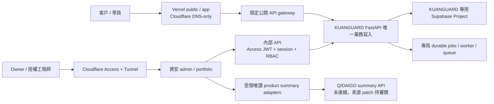

# 產品與環境隔離契約

v1.1，2026-09-10。QIDAIGO 與 KUANGUARD 共用 owner 和 SaaS 管理層，保留各自部署、資料、憑證、授權、業務帳本與工作執行範圍。既有本機 PostgreSQL、65-table restore 證據與七服務實作持續保留；沒有發生 Supabase 遷移或外部切換。

## 信任與寫入邊界

| 邊界 | 必須維持的規則 | 主要實作／證據位置 |
| --- | --- | --- |
| Cloud control | 共用 Account/Team/Org；resource IDs 明確按 product＋environment 綁定 | `infra/deployment-plan-v1.1.json`、`docs/shared-saas-inventory.md` |
| UI → API | Vercel UI/BFF 只轉送經授權請求；FastAPI 集中帳務／匯入／發布規則 | `backend/kuanguard/config.py`、`security.py`、既有 route modules |
| Identity | issuer＋subject；驗簽、issuer、audience、expiry、server membership；相同 email 不合併產品身份 | `backend/kuanguard/security.py`、`access.py`；provider 實接仍待驗證 |
| DB | 資安 Production 與非正式各自 Supabase Project；runtime 非 owner、无 BYPASSRLS；transaction context＋RLS/外鍵 | `backend/kuanguard/db.py`、`backend/migrations`；沿用既有唯一 migration owner |
| Data API | sensitive tables / views / functions 不公開；不修改 Supabase managed auth/storage/realtime schema | Supabase 啟用前 grants/RLS/Data API 檢查；Project 尚未建立 |
| 內部作業 | admin Tunnel＋Access，API 再驗 session／角色／案件；/portfolio 再限 owner／明示 grant | `infra/cloudflare/tunnel.example.yml`、`infra/gateway/admin.conf`、後端 Access 驗證 |
| 公開 API | 只允許客戶／學員／公開資訊／已簽章 webhook；拒絕 internal/portfolio/development | `infra/gateway/public-api.conf` 與後端 host/role gates；正式 ingress 尚未部署 |
| 背景工作 | KUANGUARD report/source/Gophish 工作與訂餐出單 queue、pool、CPU/RAM 隔離 | 資安 Compose 及专用容器規劃；不操作訂餐 queue |
| Storage | 分產品、環境与私有／公開 bucket；scope S3 credentials，檔案二次 tenant/role 授權 | R2 intent 及 local object adapter；R2 尚未啟用 |
| Payments | 資安演練／LMS 共 KUANGUARD 錢包；QIDAIGO GMV/fee/預存款不互抵 | `backend/kuanguard/wallet.py`、billing adapter / ledger |
| Portfolio | 僅受限來源 summary API，projection 可重建、有 TTL 与撤銷清除；不直連 QIDAIGO DB | `backend/kuanguard/portfolio.py`、`portfolio_routes.py`、`docs/qidaigo-summary-contract.md` |

Supabase 的直接 PostgreSQL connection 不會自動套用瀏覽器 JWT；每個 transaction 的 tenant/actor context 必須由可信 server session 設定，成功、例外與 rollback 後都清除。migration / backup owner 的權限不給 API runtime。敏感 views 需 security_invoker 或置於不暴露的 schema；不得用 SECURITY DEFINER 來繞過授權。

Supabase 2026-09-10 changelog 已查核：近期 Data API 自動暴露政策與 managed realtime schema 有變更；本案仍採明確 revoke/grant/RLS 與原有 migration owner，不因預設改動而假設資料不會暴露。這次只讀了組織與資源 metadata，沒有對任何既有 Supabase Project 執行 DDL。[官方 changelog](https://supabase.com/changelog)

## 新部署的實際流量

Vercel DNS-only hosts 的 TLS/CDN/firewall 由 Vercel 處理，Cloudflare WAF/Access 不保護這些流量。`www` 永久導向 apex 由 Vercel 保留 path/query；Cloudflare Full(strict) 只限適用 proxied origins。admin 不配置公開 container port 或 DNS-only Vercel alias，Preview/alternate origin 也不可繞過 Access。[Vercel reverse proxy 說明](https://vercel.com/docs/security/reverse-proxy)

## 設定與 secret 分權

每個 deployed component 保存 `product=kuanguard`、environment、expected provider IDs、approved hosts 与 release commit；Preview 指向 nonproduction Project，不使用 Production credential。QIDAIGO / beauty IDs 在部署計畫列為禁止的 foreign resources。任何 ID 欄位缺值或 live readback 屬錯產品，就拒絕 activation，不能用看似相同的 Org 名稱猜資源。

`NEXT_PUBLIC_*` 只放公開值，service_role、DB password、payment secret、S3 secret、Gophish key 與 portfolio connector credentials 只供 server/worker。KUANGUARD 不讀取訂餐 `.env` 或複製其 admin key；同一 owner 在不同產品各有明示 grant。

單人流程記錄同一真實 actor 的 QA→核定→發布與原因，不建立假的第二 reviewer。若該合約指定獨立覆核，依 contract policy 要求不同被授權 actor；此條件只約束那份合約，不妨礙一般單人流程。

## 帳務與營運指標

KUANGUARD 演練／LMS 的 reserve/consume/release/refund 使用同一 append-only wallet；不得以 QIDAIGO 交易或同 email 直接入點。即使日後商店決定共 merchant，已驗簽 callback 也須綁定可信 product/order mapping，拒絕跨產品重播。

portfolio 分開 GMV、訂餐應計／實收服務費、資安合約／實收／應收／退款及點數購買／預留／耗用。GMV 不當平台收入，購點與耗用不重算收入；只有期間、時區、幣別、含稅方式及 metric definition version 全部相容且 verified 才能合併。來源逾時、不連線或過時保持各自狀態，不用 0 或綠燈補位。

## 受影響驗證與回復

新增 DNS tests 對 apex/www/app proxy、Vercel target proxy、admin direct origin / Vercel alias 都 fail closed；實際 Tunnel UUID 符合時才允許 plan。Transport 額外拒絕 zone/settings mutation、foreign-zone discovery 與未綁定 zone 寫入，缺 zone 只產生 pending discovery。原有 full export / drift / hash / record rollback 與 DB-object restore tests 保留，`tests/test_infra.py` 21 項已通過。

部署前還需 main 與 portfolio 的跨產品 JWT、scope、RLS pool 清理、同 owner／獨立覆核 policy、public internal bypass 与 connector timeout/revocation 測試，以及真實 provider domain / alias / Preview 验證。這份契約不把檔案存在當作 live security proof。

遷移採 expand/contract；先在資安專用非正式 Project 還原、核對 records/ledger/jobs/objects 與 role grants，再 drain 舊 worker、凍結寫入、切换單一 writer。保留現有 local/source database 與映像；不直接重建、不無控制雙寫、不重發 unknown 郵件或重扣點數。

QIDAIGO repo HEAD/status/tracked diff 和 production deployment ID 在本次唯讀前後一致，證據詳 `docs/shared-saas-inventory.md`。本次沒有對其正式出單壓測或任何 schema/登入/出單/費率修改。
